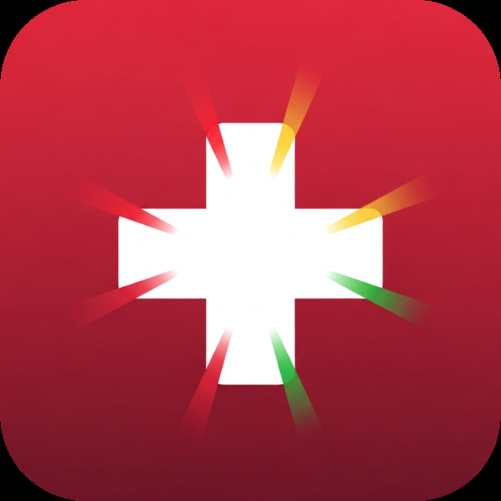

# 🚨 Signal Aid

<p align="center">
  
</p>

<p align="center">
  
  
  
  
  
</p>

## 📱 Description

**Signal Aid** is an emergency response system mobile application built with Flutter. Originally converted from a React Native/Expo project, this app helps emergency vehicle drivers navigate through traffic with ML-powered signal preemption, reducing response times and improving public safety.

The app features real-time dispatch planning, criticality-based route optimization, trip history tracking, and intersection preemption status monitoring.

---

## ✨ Features

| Feature | Description |
|---------|-------------|
| 🔐 **Driver Authentication** | Secure login with Driver ID and Vehicle Number |
| 🗺️ **Dispatch Planning** | Real-time route planning with ETA calculation |
| ⚡ **Criticality Selection** | Choose between Normal, High, and Critical emergency levels |
| 🚦 **Signal Preemption** | ML-powered traffic signal clearing for emergency vehicles |
| ⏱️ **Live Response Tracking** | Real-time countdown timer with intersection status updates |
| 📊 **Trip History** | Complete log of all emergency responses with statistics |
| 🌙 **Dark Theme** | Eye-friendly dark UI optimized for emergency vehicle use |
| 💾 **Local Storage** | Persistent data storage using SharedPreferences |

---

## 🛠️ Tech Stack

| Category | Technology |
|----------|------------|
| **Framework** | Flutter 3.27 |
| **Language** | Dart 3.6 |
| **State Management** | Provider |
| **Local Storage** | SharedPreferences |
| **Fonts** | Google Fonts (Inter) |
| **Icons** | Material Icons |
| **Build Tool** | Gradle 8.12 |

---

## 📁 Project Structure

```
signalaid_flutter/
├── android/                    # Android platform files
├── assets/
│   └── images/
│       └── icon.png           # App icon
├── lib/
│   ├── main.dart              # App entry point
│   ├── models/
│   │   ├── driver.dart        # Driver model
│   │   ├── intersection.dart  # Intersection & DispatchPlan models
│   │   └── trip.dart          # Trip & Criticality models
│   ├── providers/
│   │   └── trips_provider.dart # State management
│   ├── screens/
│   │   ├── login_screen.dart   # Login screen
│   │   ├── dispatch_screen.dart # Dispatch planning
│   │   ├── response_screen.dart # Active response tracking
│   │   └── history_screen.dart  # Trip history
│   ├── utils/
│   │   ├── app_colors.dart    # Color constants
│   │   └── dispatch_helper.dart # Business logic
│   └── widgets/
│       ├── card.dart          # Reusable card component
│       ├── criticality_picker.dart # Severity selector
│       ├── primary_button.dart # Button component
│       └── stat.dart          # Statistics display
├── pubspec.yaml               # Dependencies & configuration
└── README.md                  # This file
```

---

## 🚀 Installation

### Prerequisites

- Flutter SDK 3.27 or higher
- Dart SDK 3.6 or higher
- Android Studio / VS Code
- Android SDK (API 21+)

### Steps

1. **Clone the repository**
   ```bash
   git clone https://github.com/yourusername/signalaid_flutter.git
   cd signalaid_flutter
   ```

2. **Install dependencies**
   ```bash
   flutter pub get
   ```

3. **Run the app**
   ```bash
   flutter run
   ```

---

## 📦 Build Commands

### Debug Build
```bash
flutter build apk --debug
```

### Release Build
```bash
flutter build apk --release
```

### Build App Bundle (for Play Store)
```bash
flutter build appbundle
```

**Output Location:** `build/app/outputs/flutter-apk/app-release.apk`

---

## ⬇️ Direct Download

<p align="center">
  <a href="https://github.com/yourusername/signalaid_flutter/releases/download/v1.0.0/app-release.apk">
    
  </a>
</p>

**Minimum Requirements:**
- Android 5.0 (API Level 21) or higher
- 50MB free storage space

---

## 📸 Screenshots

<p align="center">
  <em>Screenshots coming soon...</em>
</p>

| Login Screen | Dispatch Screen | Response Screen | History Screen |
|:------------:|:---------------:|:---------------:|:--------------:|
| 🖼️ | 🖼️ | 🖼️ | 🖼️ |

---

## 🤝 Contributing

Contributions are welcome! Please feel free to submit a Pull Request.

1. Fork the repository
2. Create your feature branch (`git checkout -b feature/AmazingFeature`)
3. Commit your changes (`git commit -m 'Add some AmazingFeature'`)
4. Push to the branch (`git push origin feature/AmazingFeature`)
5. Open a Pull Request

---

## 📄 License

This project is licensed under the MIT License - see the [LICENSE](LICENSE) file for details.

---

## 👨‍💻 Author

**Signal Aid Team**

<p align="center">
  Made with ❤️ for emergency responders
</p>

---

## 🙏 Acknowledgments

- Original React Native/Expo project inspiration
- Flutter Team for the amazing framework
- All emergency responders who keep us safe

---

<p align="center">
  <strong>⭐ Star this repository if you found it helpful!</strong>
</p>
